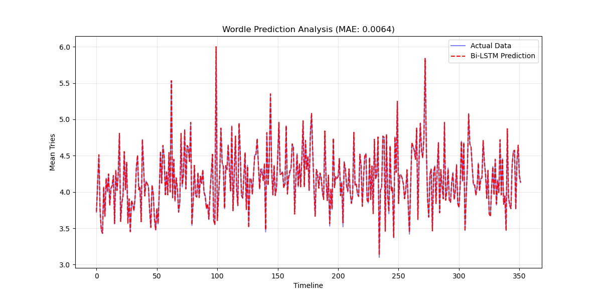

# Wordle-LSTM-Prediction
# 基于多源数据融合与双向 LSTM 的 Wordle 玩家表现预测

本仓库包含南京大学深度学习课程的期末作业：**基于深度学习的多源数据预测与模式分析**。

## 1. 项目概述
本项目旨在预测 Wordle 游戏的玩家平均猜测步数。通过整合单词的语言学特征（元音、唯一字符数）与历史统计数据，构建了一个高性能的 **Bi-LSTM (双向长短期记忆网络)** 模型。

## 2. 实验结果
模型在测试集上展现了极高的灵敏度，能够准确捕捉数据中的非线性波动（Spikes）：
- **MAE (平均绝对误差)**: 0.0064
- **RMSE (均方根误差)**: 0.0105

> **可视化说明**: 预测曲线（红虚线）能够紧密跟随真实值（蓝实线）的变化趋势，尤其在处理由于单词难度导致的波动点时表现优异。

## 3. 文件结构说明
- `train.py`: 主训练脚本，包含模型训练、评估与可视化逻辑。
- `model.py`: 定义双向 LSTM 网络结构。
- `data_utils.py`: 数据预处理、特征工程（多源特征融合）。
- `test_script.py`: 单元测试脚本，确保模型维度正确。

## 4. 如何运行
1. 安装依赖：`pip install torch pandas numpy matplotlib scikit-learn openpyxl`
2. 运行训练：`python train.py`
3. 运行测试：`python test_script.py`

## 5. 参考文献与数据
- 数据来源：2023 MCM Problem C
- 托管平台：Hugging Face (https://huggingface.co/datasets/qwqqwqqwq121/Wordle-MCM-Dataset)
